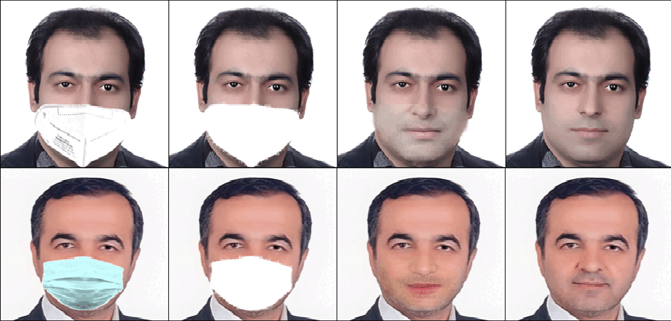

<html>

<head>

<!-- Global site tag (gtag.js) - Google Analytics -->

  <meta name=viewport content="width=800">
  <meta name="generator" content="HTML Tidy for Linux/x86 (vers 11 February 2007), see www.w3.org">
  
  <!-- <link rel="icon" type="image/png" href="images/icon.png"> -->
  <title>Shivanand Venkanna Sheshappanavar</title>
  <meta http-equiv="Content-Type" content="text/html; charset=us-ascii">
  <link href='https://fonts.googleapis.com/css?family=Lato:400,700,400italic,700italic' rel='stylesheet' type='text/css'>
</head>

<body>
  <table width="900" border="0" align="center" cellspacing="0" cellpadding="0">

        <!-- Publications-->
        <table width="100%" align="center" border="0" cellspacing="0" cellpadding="20">
	  <!-- IFOR -->
	  <!-- Non-deep Networks -->
          <tr>
            <td width="35%">
              
            </td>
            <td valign="top" width="70%">
              

                <a href="https://ieeexplore.ieee.org/document/9565556">
                  <papertitle>Dynamic local geometry capture in 3d point cloud classification</papertitle>
                </a>
                 
                <strong>Shivanand Venkanna Sheshappanavar</strong>, Chandra Kambhamettu
                 
                <em>MIPR 2021</em>
		 
		<a href="https://ieeexplore.ieee.org/document/9565556">[paper]</a> <a href="https://github.com/VimsLab/DynamicScale">[code]</a> <a href="https://youtu.be/Ev44a02mwCg">[video]</a> 
                <!--  &nbsp; &nbsp;
                 -->
		
 PointNet++ model uses ball querying for local geometry capture in its set abstraction layers. Several models based on single scale grouping of PointNet++ continue to use ball querying with a fixed-radius ball. However, ball lacks orientation and is ineffective in capturing complex or varying geometry proportions from different local neighborhoods on the object surface. We propose a novel technique of dynamically oriented and scaled ellipsoid based on unique local information to capture the local geometry better. We also propose ReducedPointNet++, a single set abstraction based single scale grouping model. 

            </td>
          </tr>
        </table>
      </td>
    </tr>
  </table>

</body>

</html>

